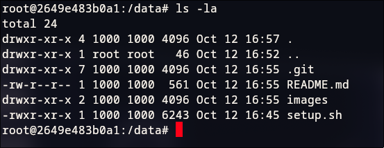
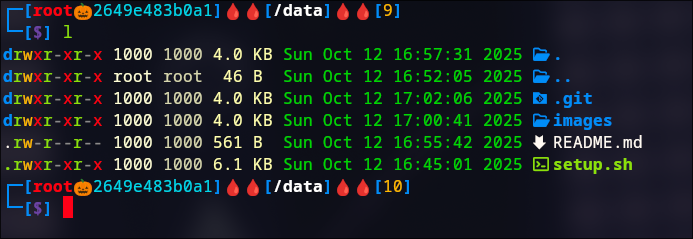

# Auto Shell/Prompt config
This script install and configure zsh shell and oh_my_zsh plugins, plus other stuff like `lsd` in order to have a nice and enjoyable prompt and shell experience.

[*] Make sure to have `sudo`.

Works on `Debian` like | `Arch` like | `RedHat` like.

# How to install ? 

```git clone https://github.com/Chibraax/auto_zsh```

```cd auto_zsh```

```chmod +x setup.sh```

```./setup.sh```

# Before (classic BASH):

  

# After : 

  

 # Features :
  `fzf`: By pressing Ctrl + r, you can search through your command history.

  `zsh-syntax-highlighting`: This package provides syntax highlighting for the shell zsh. It enables highlighting of commands whilst they are typed at a zsh prompt into an interactive terminal. This helps in reviewing commands before running them, particularly in catching syntax errors.
  
  `zsh-autosuggestions`: It suggests commands as you type based on history and completions.
  
  `zsh-history-substring-search`: This is a clean-room implementation of the Fish shell's history search feature, where you can type in any part of any command from history and then press chosen keys, such as the UP and DOWN arrows, to cycle through matches.

  `lsd`: 
